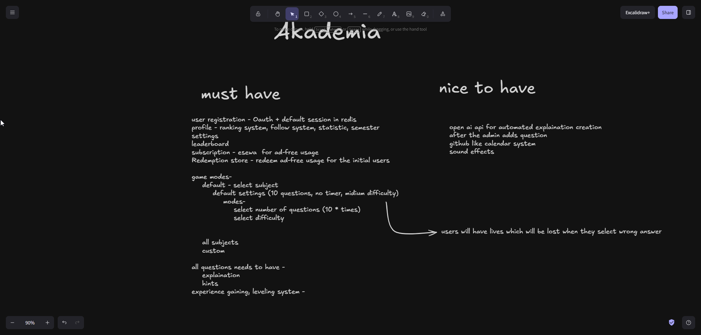
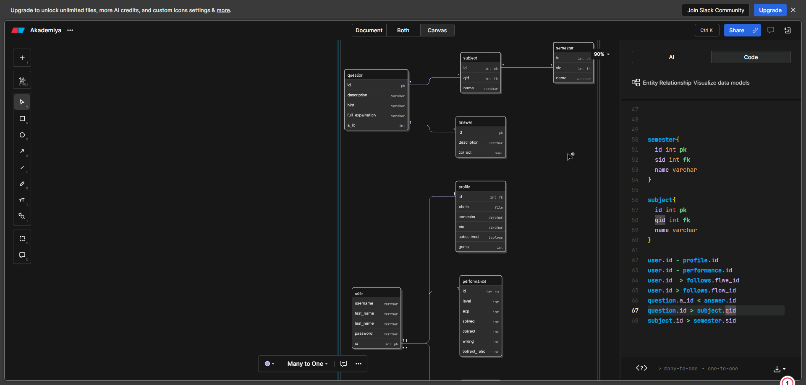

<h1>Akademia</h1>
<p>This is a MCQ site gamified. I intend to build this to help others have fun time preparing for mcq for their actual exams. 
I am personally going to use this site.</p>
<h4>Technologies used: </h4>
<ol>
<li>Django rest framework</li>
<li>Postgre SQL</li>
<li>Redis</li>
<li>Docker</li>
<li>Oauth</li>
<ol>



--> Create .env.local and add the things listed below. we are using postgresql for database. https://medium.com/django-unleashed/complete-tutorial-set-up-postgresql-database-with-django-application-d9e789ffa384
```
DEBUG=True
ALLOWED_HOSTS=localhost,127.0.0.1

DB_NAME
DB_USER
DB_PASSWORD 
DB_HOST 
DB_PORT

EMAIL_BACKEND = 'django.core.mail.backends.smtp.EmailBackend'
EMAIL_HOST = 'smtp.example.com' # Use your email provider's SMTP host (e.g., smtp.gmail.com)
EMAIL_PORT = 587 
EMAIL_USE_TLS = True 
EMAIL_HOST_USER = 'your_email@example.com' # The email used for SMTP authentication
EMAIL_HOST_PASSWORD = 'your_app_password' # Use an app password if using services like Gmail
DEFAULT_FROM_EMAIL = 'support@yourwebsite.com' # The default "From" address
SERVER_EMAIL = 'support@yourwebsite.com' # Used for error messages to admins
```