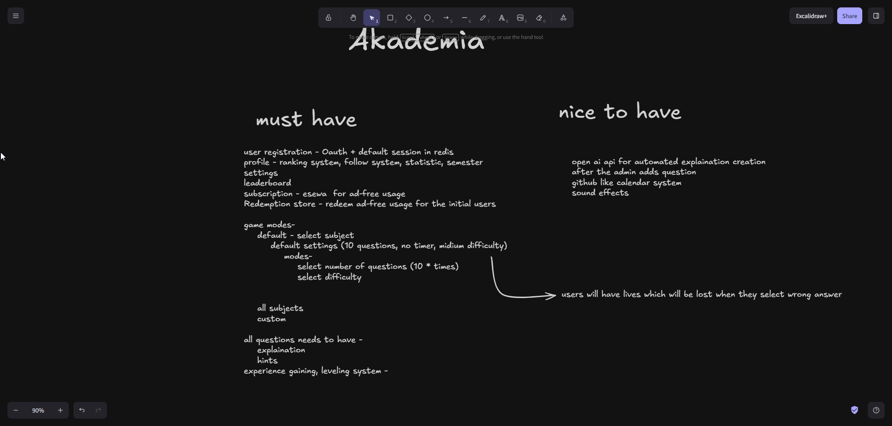
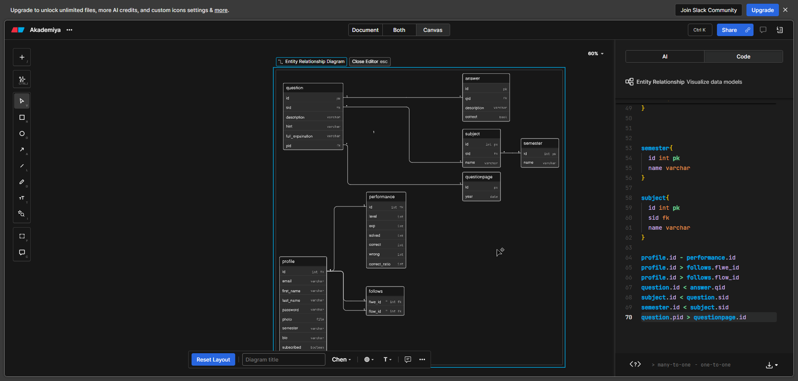

# Akademiya

Akademiya is a gamified multiple-choice question (MCQ) learning platform built with Django REST Framework. It is designed to help learners prepare for exams through practice quizzes, user progress tracking, leaderboards, and a modular backend architecture.

## Features

- Django REST API backend
-  reSQL database support
- Redis caching and session support
- Docker Compose development environment
- Google OAuth via `django-allauth`
- Gamification features: leaderboards, store, user profiles, quiz progress
- Admin and management tools for content and user control

## Technology Stack

- Python 3 / Django 6
- Django REST Framework
- PostgreSQL
- Redis
- Docker + Docker Compose
- Django Allauth (Google social login)
- Gunicorn for production WSGI
- WhiteNoise for static file serving

## Quick Start

### 1. Clone the repository

```bash
git clone https://your-repo-url.git
cd Akademiya
```

### 2. Create environment file

Create a `.env` file in the project root with the following variables:

```env
DEBUG=True
SECRET_KEY=your-secret-key
ALLOWED_HOSTS=localhost,127.0.0.1

DB_NAME=your_db_name
DB_USER=your_db_user
DB_PASSWORD=your_db_password
DB_HOST=your_db_host
DB_PORT=5432

REDIS_URL=redis://redis:6379/1

EMAIL_BACKEND=django.core.mail.backends.smtp.EmailBackend
EMAIL_HOST=smtp.example.com
EMAIL_PORT=587
EMAIL_USE_TLS=True
EMAIL_HOST_USER=your_email@example.com
EMAIL_HOST_PASSWORD=your_email_password
DEFAULT_FROM_EMAIL=support@yourwebsite.com
SERVER_EMAIL=support@yourwebsite.com

google_client_id=your_google_client_id
google_secret=your_google_secret

CORS_ALLOWED_ORIGINS=http://localhost:3000,http://127.0.0.1:3000
CSRF_TRUSTED_ORIGINS=http://localhost:3000,http://127.0.0.1:3000
SESSION_COOKIE_SECURE=False
CSRF_COOKIE_SECURE=False
```

> The project uses `python-dotenv` to load environment variables from `.env`.

### 3. Install dependencies

If you want to run locally without Docker:

```bash
python -m venv .venv
.venv\Scripts\activate
pip install -r requirements.txt
```

### 4. Apply migrations

```bash
python manage.py migrate
```

### 5. Create a superuser

```bash
python manage.py createsuperuser
```

### 6. Run the development server

```bash
python manage.py runserver
```

Open `http://127.0.0.1:8000`

## Docker Setup

This project includes `docker-compose.yml` and `docker-compose.override.yml` for local development.

Start with:

```bash
docker compose up --build
```

This launches:

- `web`: Django application served by Gunicorn
- `db`: PostgreSQL database
- `redis`: Redis cache

### Local Docker development

`docker-compose.override.yml` overrides the web service command to run Django in development mode and mounts the repository into the container so code changes are reflected immediately.

## Deployment Notes

- In production, use `DEBUG=False`
- Provide a strong `SECRET_KEY`
- Configure `ALLOWED_HOSTS` for your deployment domain
- Set SMTP credentials for email delivery
- Ensure Redis and PostgreSQL are reachable from your deployment environment

## Google OAuth Setup

The project includes Google provider settings under `SOCIALACCOUNT_PROVIDERS` in `Akademiya/settings.py`.

You must provide:

- `google_client_id`
- `google_secret`

Set these values in your `.env` file and configure a Google Cloud OAuth application with the correct redirect URI.

## Environment Variables Summary

Required variables:

- `SECRET_KEY`
- `DEBUG`
- `ALLOWED_HOSTS`
- `DB_NAME`
- `DB_USER`
- `DB_PASSWORD`
- `DB_HOST`
- `DB_PORT`
- `REDIS_URL`
- `EMAIL_BACKEND`
- `EMAIL_HOST`
- `EMAIL_PORT`
- `EMAIL_USE_TLS`
- `EMAIL_HOST_USER`
- `EMAIL_HOST_PASSWORD`
- `DEFAULT_FROM_EMAIL`
- `SERVER_EMAIL`
- `google_client_id`
- `google_secret`

Optional / recommended:

- `CORS_ALLOWED_ORIGINS`
- `CSRF_TRUSTED_ORIGINS`
- `SESSION_COOKIE_SECURE`
- `CSRF_COOKIE_SECURE`

## Useful Commands

```bash
python manage.py runserver
python manage.py migrate
python manage.py createsuperuser
python manage.py test
docker compose up --build
```

## Project Structure

- `Akademiya/` – Django project settings and entry points
- `base/` – core app with models, permissions, views, and serializers
- `users/`, `profiles/`, `game/`, `leaderboard/`, `store/`, `admintool/` – feature apps
- `requirements.txt` – Python dependencies
- `docker-compose.yml` – production-ready Docker Compose config
- `docker-compose.override.yml` – local development override

## Images




